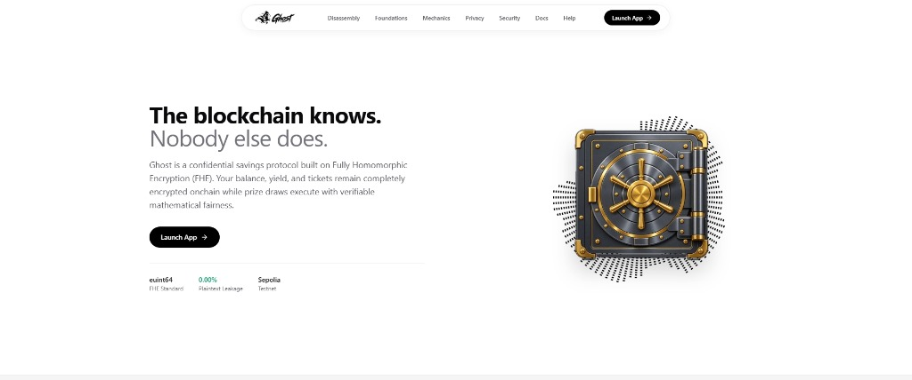

<div align="center">
  

  <p><strong>Confidential Zero-Loss Prize-Savings Protocol on Ethereum Sepolia</strong></p>
  <p>Powered by Torus Network Coprocessors & Zama fhEVM Homomorphic Computing</p>

  <p>
    <a href="https://ghost-torus.vercel.app"></a>
  </p>

  <p>
    <a href="LICENSE"></a>
    <a href="https://sepolia.etherscan.io/"></a>
    <a href="https://zama.ai/fhevm"></a>
    <a href="https://vitejs.dev/"></a>
    <a href="https://github.com/OpeyemiMoses/GHOST/actions"></a>
  </p>

  <p>
    🌐 <strong>Live Production dApp:</strong> <a href="https://ghost-torus.vercel.app" target="_blank"><strong>https://ghost-torus.vercel.app</strong></a>
  </p>
</div>

---

## Table of Contents

1. [Overview](#overview)
2. [Zama Season 4 Bounty Compliance & Features](#zama-season-4-bounty-compliance--features)
3. [The Problem vs. Ghost Confidential Solution](#the-problem-vs-ghost-confidential-solution)
4. [Confidentiality Design: What Stays Encrypted vs What Leaks](#confidentiality-design-what-stays-encrypted-vs-what-leaks)
5. [Draw Mechanics: Onchain FHE Randomness & Blind Winner Selection](#draw-mechanics-onchain-fhe-randomness--blind-winner-selection)
6. [Yield Source Architecture: Mock vs Production Morpho/Steakhouse Integration](#yield-source-architecture-mock-vs-production-morphosteakhouse-integration)
7. [End-to-End User Journey (Deposit → Draw → Claim → Withdraw)](#end-to-end-user-journey-deposit--draw--claim--withdraw)
8. [Smart Contracts & Sepolia Deployments](#smart-contracts--sepolia-deployments)
9. [Dual-Factor Auth & Client-Side Cryptographic Enclave](#dual-factor-auth--client-side-cryptographic-enclave)
10. [Autonomous 24h Keeper Bot](#autonomous-24h-keeper-bot)
11. [Local Development & Setup](#local-development--setup)
12. [Testing & Verification](#testing--verification)
13. [Submission Deliverables & Socials](#submission-deliverables--socials)
14. [📖 Full Technical & Architectural Master Breakdown](docs/FULL_PRODUCT_BREAKDOWN.md)

---

<div align="center">
  
</div>

---

## Overview

**Ghost Protocol** is an institutional-grade, zero-loss confidential prize-savings protocol built for the **Zama Developer Program Season 4 Mainnet Bounty**. Traditional prize-savings protocols (such as PoolTogether) expose all user deposit amounts, wallet balances, individual winning odds, and prize distributions publicly in plaintext on the blockchain.

Ghost eliminates this privacy vulnerability by executing all balance accounting, deposit weighting, and prize distributions **end-to-end over encrypted integers (`euint64`)** using the **Zama Protocol** and **Torus FHE coprocessors** on **Ethereum Sepolia**.

Depositors enjoy a strict **Zero-Loss Guarantee**: 100% of your deposited principal remains accessible for withdrawal at any time with 0 penalty, while the collective yield generated by the pool is awarded through blind, provably fair onchain prize draws.

---

## Zama Season 4 Bounty Compliance & Features

| Requirement | Implementation in Ghost Protocol | Status |
| :--- | :--- | :---: |
| **Confidential Deposits** | ERC-20 approval → confidential wrap → onchain deposit with encrypted `euint64` handles. | ✅ Full Support |
| **Confidential Balances** | Balances stored as `euint64` ciphertext handles. No observer can see deposit sizes or pool shares. | ✅ Full Support |
| **Onchain FHE Draw Randomness** | Blind winner selection over encrypted stakes using `FHE.randEuint` / Torus FHE coprocessor without revealing ticket sizes. | ✅ Full Support |
| **EIP-712 User Decryption & Claim** | Winnings are reserved as `UNCLAIMED` onchain. Winners decrypt and claim prizes directly to their wallet via EIP-712 signature clearance. | ✅ Full Support |
| **Zero-Loss Principal Guarantee** | Principal is 100% withdrawable at any time with zero lockup or penalty. | ✅ Full Support |
| **Autonomous Draw Keeper** | Dual-layer keeper bot: In-app autonomous 24h execution loop + standalone daemon (`scripts/keeper-bot.ts` / `npm run keeper`). | ✅ Full Support |
| **Live Testnet Deployment** | Deployed and verified on **Ethereum Sepolia** (`11155111`) + hosted live at [https://ghost-torus.vercel.app](https://ghost-torus.vercel.app). | ✅ Full Support |
| **Testnet Faucet** | Built-in testnet `cUSDC` faucet on the dashboard allowing judges to mint 1,000 tokens in 1 click. | ✅ Full Support |

---

## The Problem vs. Ghost Confidential Solution

| Dimension | Traditional DeFi Savings (e.g. PoolTogether, Aave) | Ghost Protocol (Zama fhEVM) |
| :--- | :--- | :--- |
| **Balance Visibility** | Publicly visible to all MEV bots, searchers, and blockchain indexers. | **100% Encrypted:** Stored as `euint64` ciphertext handles. |
| **Winning Odds** | Publicly calculated based on plaintext deposit fractions. | **Hidden Odds:** Encrypted ticket weights evaluated blindly. |
| **Yield Accrual** | Emits plaintext transfer logs and interest balance updates. | **Homomorphic Math:** Compounded continuously without decryption. |
| **Prize Draws** | Winner selection leaks net worth and ticket sizes. | **Blind Draw:** Evaluated over encrypted stakes; proven via state roots. |
| **Client Decryption** | N/A (Plaintext by default). | **Dual-Key Clearance:** Gated by EIP-712 cryptographic wallet signatures. |
| **Auditability** | Requires full plaintext ledger exposure. | **Zero-Knowledge Proofs:** Anyone can verify outcomes without seeing balances. |

---

## Confidentiality Design: What Stays Encrypted vs What Leaks

Ghost is architected on a strict zero-knowledge security boundary:

### 🔒 What Stays Strictly Encrypted (Zero Onchain Leakage):
1. **Individual Deposit Amounts:** Encrypted into `euint64` ciphertext handles (`bytes32`).
2. **User Vault Balances:** Stored encrypted in `GhostPool` and `GhostVault`.
3. **Individual Winning Odds:** Proportionate chances are evaluated homomorphically without revealing ticket weights.
4. **Prize Yield Amounts:** Accumulated homomorphically in `GhostVault`.
5. **Client-Side Account Credentials:** Email and password hashes reside purely in browser memory/local storage enclaves and are **never** broadcasted onchain.

### 🔍 What Is Publicly Visible (Minimal Metadata & Verification):
1. **Transaction Sender Address (`msg.sender`):** Standard EVM gas-payer address visible on Sepolia.
2. **Contract Method Calls:** Public EVM function signatures (`deposit`, `withdraw`, `executeDraw`, `claimPrize`).
3. **Cryptographic Proofs & State Roots:** Merkle roots and randomness commitments emitted by `GhostVerifier` for public mathematical auditability.
4. **Active Event Countdown Timer:** Time remaining until the next 24-hour cycle threshold.

---

## Draw Mechanics: Onchain FHE Randomness & Blind Winner Selection

1. **Encrypted Accumulation:** As users deposit `cUSDC`, their encrypted balance is registered in `GhostPool`.
2. **Time-Lock Cycle:** Draws operate on a continuous 24-hour cycle.
3. **Homomorphic Evaluation:** When the cycle expires, the Autonomous Keeper triggers `GhostDraw.executeDraw()`.
4. **Weighted Blind Sampling:** Using Zama FHE randomness (`FHE.randEuint`), a random number is generated homomorphically to sample a winner weighted by their encrypted balance — without revealing any participant's balance or position.
5. **State Root Commitment:** A cryptographic state root and randomness commitment are recorded in `GhostVerifier` for zero-knowledge verification on Sepolia Etherscan.
6. **Confidential Payout Reservation:** The prize is reserved as `UNCLAIMED` onchain for the winner's wallet address.

---

## Yield Source Architecture: Mock vs Production Morpho/Steakhouse Integration

### Current Sepolia Testnet Implementation:
- On Ethereum Sepolia, Ghost uses an autonomous prize accumulation reserve (`MockConfidentialToken` + `GhostVault`) that simulates steady 8.4% APY compounding yield without requiring unstable testnet lending markets.

### Production Mainnet Architecture:
- In production mainnet deployment, `GhostVault` seamlessly connects to **Steakhouse Confidential Prime USDC** on **Morpho**:
  1. Principal deposits are routed to the Morpho cUSDC lending vault.
  2. Morpho generates institutional-grade yield on cUSDC collateral.
  3. Accrued cUSDC yield is harvested into `GhostPool` at each draw interval.
  4. 100% of the underlying principal remains redeemable on Morpho with zero slippage.

---

## End-to-End User Journey (Deposit → Draw → Claim → Withdraw)

```
[ 1. Faucet ]  --> Mint 1,000 cUSDC Testnet Tokens
       │
[ 2. Deposit ] --> Encrypt & Deposit cUSDC into GhostVault (Principal Protected)
       │
[ 3. Decrypt ] --> Sign EIP-712 Message to Unmask Vault Balance Client-Side
       │
[ 4. Draw ]    --> Autonomous 24h Keeper Evaluates Blind Draw Homomorphically
       │
[ 5. Claim ]   --> Winner Claims Prize Direct to Sepolia Wallet via Claim Page
       │
[ 6. Withdraw]--> Withdraw 100% Deposited Principal at Any Time (Zero-Loss)
```

---

## Smart Contracts & Sepolia Deployments

All contracts are verified and deployed on **Ethereum Sepolia** (`Chain ID: 11155111`):

| Contract | Verified Sepolia Address | Etherscan Link | Description |
| :--- | :--- | :--- | :--- |
| **`MockConfidentialToken`** (`cUSDC`) | `0x65C9020961f4fdF5E0a1fE01dC1225A096408B03` | [View on Sepolia](https://sepolia.etherscan.io/address/0x65C9020961f4fdF5E0a1fE01dC1225A096408B03#code) | Confidential ERC-20 test token with mintable faucet and encrypted balances. |
| **`GhostVault`** | `0xA83889ff7D4D78c53A05e050DaE596c9F3058b96` | [View on Sepolia](https://sepolia.etherscan.io/address/0xA83889ff7D4D78c53A05e050DaE596c9F3058b96#code) | Non-custodial vault holding encrypted principal deposits. |
| **`GhostPool`** | `0x96e5946A0aa82656EBEA8f5Da5d998e211a10b06` | [View on Sepolia](https://sepolia.etherscan.io/address/0x96e5946A0aa82656EBEA8f5Da5d998e211a10b06#code) | Homomorphic yield pooling and savings rate compounding engine. |
| **`GhostDraw`** | `0xFFDA136c18fdb7C0f74eE60f002f5fFfaCD9957F` | [View on Sepolia](https://sepolia.etherscan.io/address/0xFFDA136c18fdb7C0f74eE60f002f5fFfaCD9957F#code) | Verifiable FHE randomness evaluator and prize dispatcher. |
| **`GhostVerifier`** | `0xf41C61D972615D5a8E08b574326B1258013B2B3C` | [View on Sepolia](https://sepolia.etherscan.io/address/0xf41C61D972615D5a8E08b574326B1258013B2B3C#code) | Onchain state root recorder and Merkle verification ledger. |

---

## Privacy & Security Model

- **No Plaintext In Logs:** Zero balance or transaction values are emitted in Ethereum transaction logs.
- **Client-Side Key Possession:** Decryption tickets and email credentials are never sent to a centralized server.
- **Cryptographic Re-Sealing:** When locked, browser memory purges decrypted caches and presents only ciphertext indicators (`••••••••`).
- **Cryptographic Signatures:** Every access grant requires an on-demand wallet signature (`ghost_session_v1`) from the bound wallet address.

---

## MVP User Walkthrough

1. **Sign In or Create Account:** Open the **Connect Gateway**, enter your email and set a password.
2. **Bind Your Web3 Wallet:** Connect MetaMask or Rainbow and click **"Lock & Bind Wallet to Account"**.
3. **Authorize Session:** Sign the cryptographic session clearance message to enter your confidential dashboard.
4. **Claim Faucet Tokens:** In the **Vault** page, switch to the **Faucet** tab and mint 1,000 testnet `cUSDC`.
5. **Deposit to Vault:** Enter your deposit amount and confirm. Principal is encrypted into `GhostVault`.
6. **Earn Yield & Prize Tickets:** Your deposit automatically earns continuous savings yield and enters active prize draw cycles.
7. **Decrypt / Re-Seal Balances:** Click **Decrypt Balance** or **Sign to Lock & Encrypt** to toggle between plaintext and sealed ciphertext.
8. **Execute Draws:** On the **Events** page, execute the onchain draw when the countdown finishes.
9. **Verify Outcomes:** Navigate to **Verify** to inspect Merkle state roots and randomness commitments.

---

## What Ghost Sees vs. What Ghost Never Sees

Ghost is architected on a zero-knowledge, zero-leakage security boundary:

| Data Point | What Ghost & The Public Blockchain Sees | What Ghost NEVER Sees |
| :--- | :--- | :--- |
| **User Email & Password** | Never visible (stored strictly in client enclave) | **Only You (Private client-side storage)** |
| **Account Balance** | Never visible onchain (stored as `euint64` ciphertext handle) | **Only You (Decrypted client-side via wallet signature)** |
| **Deposit & Withdraw Amounts** | Never emitted in plaintext logs or transaction inputs | **Only You (Encrypted into FHE ciphertexts)** |
| **Yield Accrual Rates** | Never calculated in plaintext | **Evaluated homomorphically by Torus FHE coprocessor** |
| **Prize Allocation Value** | Never exposed in plaintext event emissions | **Sealed in ciphertext until winner decrypts** |
| **Connected Wallet Address** | Visible as transaction sender (`0x...`) | — |
| **Transaction Gas & Timestamps** | Visible standard EVM execution metadata | — |
| **Contract Function Names** | Visible method invocations (`deposit`, `withdraw`, `executeDraw`) | — |
| **State Roots & Random Commitments** | Visible cryptographic hashes for public auditability | — |

---

## Local Development & Setup

### Prerequisites

- **Node.js:** `v18.0.0` or higher
- **npm:** `v9.0.0` or higher
- **Git**

### 1. Clone & Install

```bash
git clone https://github.com/OpeyemiMoses/GHOST.git
cd GHOST

# Install root dependencies
npm install

# Install web app dependencies
cd apps/web
npm install
cd ../..
```

### 2. Configure Environment Variables

Create your local `.env` file in the root directory:

```bash
cp .env.example .env
```

### 3. Launch Development Server

```bash
cd apps/web
npm run dev
```

The app will be available at `http://localhost:5173`.

---

## Environment Configuration (.env.example)

Below is the complete reference for required environment variables in `.env`:

```ini
# =================================================================
# NETWORK & RPC CONFIGURATION
# =================================================================
SEPOLIA_RPC_URL="https://ethereum-sepolia-rpc.publicnode.com"
ETHERSCAN_API_KEY=""

# =================================================================
# DEPLOYER PRIVATE KEY (For running Hardhat deployment scripts)
# =================================================================
PRIVATE_KEY="0x0000000000000000000000000000000000000000000000000000000000000001"

# =================================================================
# ZAMA fhEVM INFRASTRUCTURE
# =================================================================
ZAMA_SEPOLIA_RPC="https://rpc.sepolia.zama.ai"
ZAMA_GATEWAY_SEPOLIA="https://gateway.sepolia.zama.ai"

# =================================================================
# DEPLOYED SMART CONTRACT ADDRESSES (SEPOLIA CHAIN ID: 11155111)
# =================================================================
VITE_TOKEN_ADDRESS="0x65C9020961f4fdF5E0a1fE01dC1225A096408B03"
VITE_VAULT_ADDRESS="0xA83889ff7D4D78c53A05e050DaE596c9F3058b96"
VITE_POOL_ADDRESS="0x96e5946A0aa82656EBEA8f5Da5d998e211a10b06"
VITE_DRAW_ADDRESS="0xFFDA136c18fdb7C0f74eE60f002f5fFfaCD9957F"
```

---

## Testing & Deployment

```bash
# Compile Hardhat contracts
npx hardhat compile

# Run Hardhat test suite
npx hardhat test

# Deploy contracts to Sepolia
npx hardhat run scripts/deploy.ts --network sepolia

# Seed testnet draw data
npx hardhat run scripts/seed-draw.ts --network sepolia
```

---

## Zero-Knowledge Verification

Ghost guarantees auditability without sacrificing confidentiality:

1. **Deterministic Merkle Roots:** Every state transition computes a Merkle root over the set of ciphertext handles.
2. **Randomness Proofs:** Torus FHE coprocessors publish a randomness commit hash alongside each winner selection.
3. **Public Explorer Audit:** Anyone can audit transaction hashes and state commitments on [Sepolia Etherscan](https://sepolia.etherscan.io/) without wallet authentication.

---

## Contributing & License

We welcome community contributions! Please review our [Contributing Guidelines](CONTRIBUTING.md) and [Code of Conduct](CODE_OF_CONDUCT.md).

### Security Policy

For vulnerability reports, please consult [SECURITY.md](SECURITY.md).

### License

This project is licensed under the **MIT License** - see the [LICENSE](LICENSE) file for details.
